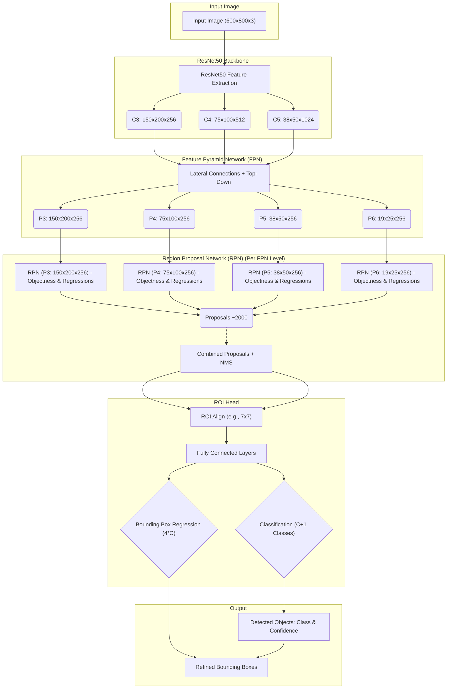

```mermaid
graph TD
  subgraph "Input Image"
	  A["Input Image (600x800x3)"]
  end

  subgraph "ResNet50 Backbone"
	B[ResNet50 Feature Extraction] --> C(C3: 150x200x256)
	B --> D(C4: 75x100x512)
	B --> E(C5: 38x50x1024)
  end

  subgraph "Feature Pyramid Network (FPN)"
    F["Lateral Connections + Top-Down"] --> G(P3: 150x200x256)
    F --> H(P4: 75x100x256)
    F --> I(P5: 38x50x256)
    F --> J(P6: 19x25x256)
  end

  subgraph "Region Proposal Network (RPN) (Per FPN Level)"
    K["RPN (P3: 150x200x256) - Objectness & Regressions"] --> L(Proposals ~2000)
    M["RPN (P4: 75x100x256) - Objectness & Regressions"] --> L
    N["RPN (P5: 38x50x256) - Objectness & Regressions"] --> L
    O["RPN (P6: 19x25x256) - Objectness & Regressions"] --> L
    L -.-> P["Combined Proposals + NMS"]
  end

  subgraph "ROI Head"
    P --> Q["ROI Align (e.g., 7x7)"]
    Q --> R["Fully Connected Layers"]
    R --> S{"Classification (C+1 Classes)"}
    R --> T{"Bounding Box Regression (4*C)"}
  end

  subgraph "Output"
    S --> U["Detected Objects: Class & Confidence"]
    T --> V["Refined Bounding Boxes"]
  end

  A --> B
  C --> F
  D --> F
  E --> F
  G --> K
  H --> M
  I --> N
  J --> O
  P --> Q
  U --> V
```
